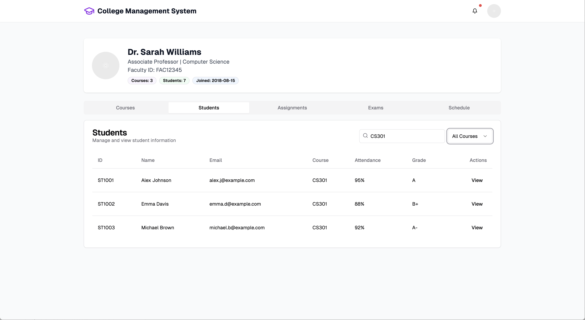

# College Management System

The College Management System is a full-stack application designed to manage all academic and administrative activities of a college with dedicated portals for different users.

## Tech Stack

React, 
Redux, 
Tailwind CSS,  
Node.js, 
Express.js,
Next.js,  
MongoDB  

## User Roles and Features

---

### 🟢 Common Screens

**Home_Page**

**Login**

**LoginAS**

---

### 🛡️ Admin Portal

- Department Management
- System Logs
- Approvals
- User Management (Students, Faculty, Parents, Finance Staff)

#### Admin Screens

**Department Management**

**System Logs**

**Approvals**

**User Management**

---

### 🎓 Student Portal

- View Courses
- Download Assignments
- Exam Results
- Financial Details
- Notifications

#### Student Screens

**Courses Enrolled**

**Assignments**

**Exams**

**Financial Details**

**Notifications**

---

### 👨‍🏫 Faculty Portal

- Manage Courses & Assignments
- Enter Exam Grades
- View Schedules
- Manage Students & Search Students

#### Faculty Screens

**Courses**

**Assignments**

**Exams**

**Schedules**

**Student List**

**Student Search**

---

### 💰 Finance Portal

- Manage Fee Structure
- Record Payments
- Manage Scholarships
- Track Expenses and Invoices

#### Finance Screens

**Fee Structure**

**Payments**

**Scholarships**

**Expenses**

**Invoices**

---

### 👨‍👩‍👧 Parent Portal

- Track Academic Progress
- View Assignments
- Monitor Attendance
- Communicate with Faculty
- View Financial Information

#### Parent Screens

**Academic Progress**

**Assignments**

**Attendance**

**Communication**

**Financial Details**

# CMS
